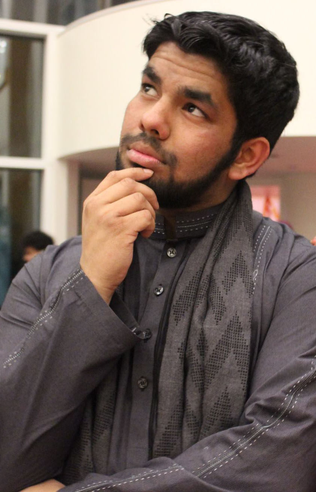

# The Longer Version

I'm a bit of an eccentric individual whose favorite thing to do, above all, is
learn. I'm pretty much the biggest STEM junkie you will possibly ever find,
and by that I mean a junkie in all 4 of the fields encompassed by the acronym.
I received both my Bachelors of Science ('15) and Masters of Engineering ('16)
from [Cornell University](http://www.cornell.edu), the former in both chemical engineering and computer
science, and the latter in biomedical engineering. My lovely time in Ithaca, NY
spanned not only multiple disciplines, but also multiple summer internships at
Goldman Sachs and multiple research labs, the most notable of which was my work with
the [Adie Lab](http://adie.research.engineering.cornell.edu) in dynamic real-time
GPU-accelerated optical coherence elastography.

I am presently pursuing my
Ph. D.in biomedical engineering at [Yale University](http://www.yale.edu), and
in my third year. I am a member of the [Hyder Lab](http://seas.yale.edu/faculty-research/faculty-directory/ds-fahmeed-hyder)
where my project falls under the umbrella term "molecular imaging of cancer."
More accurately, I am using Biosensor Imaging of Redundant Deviations in Shifts
(BIRDS), a technique in magnetic resonance spectroscopy, to ascertain a mapping
between neural physiology and the chemical shift of the nucleus sodium-23.

I like to, however, have personal interests that span a variety of fields. If
I had it my way, I would be able to study all of my interests at the same time. In
addition to the core concepts of my field, you'll often find me reading up on the
nitty gritty of quantum field theory in physics, the Curry-Howard isomorphism in
formal language type theory, or anything new in the exciting field of stem cell
engineering (to name a stark few). It's especially exciting when I find something that
combines two seemingly different topics; one of my favorites is Karp's application
of mathematical group theory to nucleotide sequences ([here]({{ site.url }}/docs/group_theory_DNA.pdf)).

Here is a list of things you could probably have a healthy conversation with
me about:

* Mathematics
  - Measure Theorey
  - Analytical Calculus/Differential Geometry
  - Abstract Algebra
* Physics
  - Quantum Mechanics/Quantum Mechanical Formulations
  - Langragian Mechanics
  - Solid-State/Condensed Matter Physics
  - General Relativity
  - (Super-)String Theory
* Chemistry
  - Physical Chemistry
  - Molecular Dynamics
  - Molecular Orbital Theory
  - Statistical Thermodynamics
* Biology
  - Molecular and Systems Biology
  - Genomics and Computational Biology
  - Biochemistry
  - Stem Cell Engineering
  - Bioimaging (MRI, PET, CT, Optical, etc.)
* Computer Science
  - Multi-Paradigm Programming
  - Programming Language Theory (Type Theory)
  - (Typed) Lambda Calculus
  - Algorithm Design and Analysis
  
..and the list goes on. If you know something about any of those, or something
else entirely, feel free to reach out.


Those interested can also feel free to look at my official [resume]({{site.url}}/docs/MK_CV.pdf).